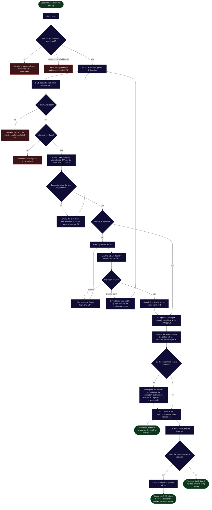
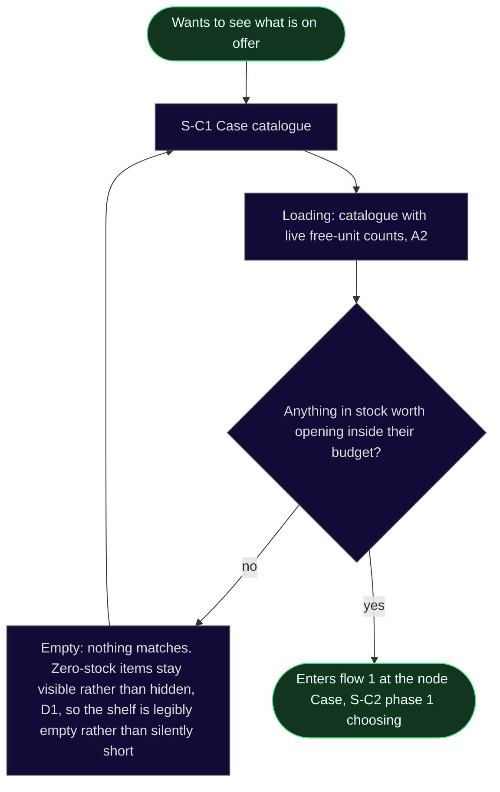
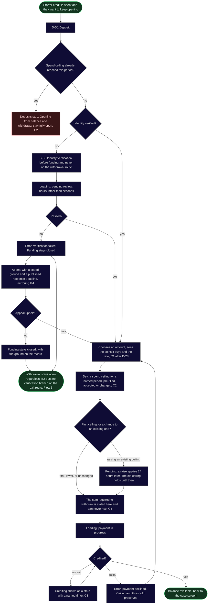
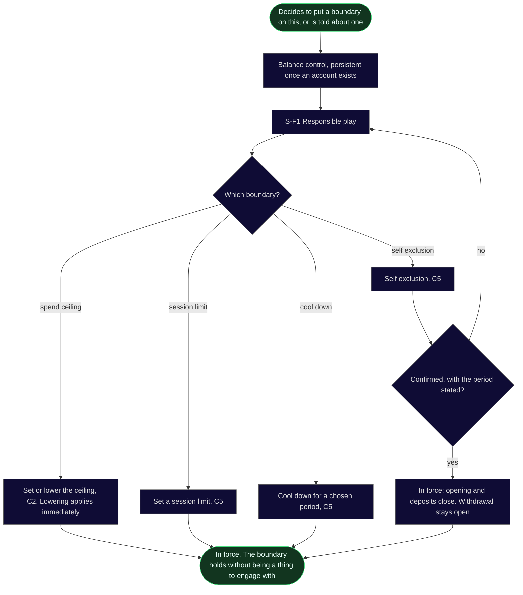
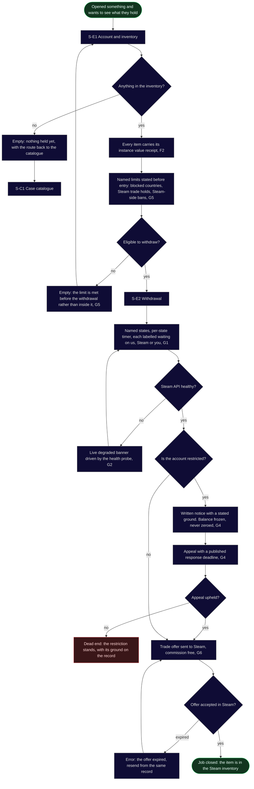
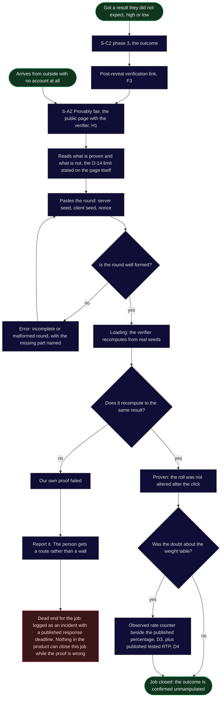

# User flows

Stage 03a, step 4, written on 11 August 2026. **Revised at step 6** after the two instrument critique: nine defects fixed, one screen code namespace renamed, one flow added.

**Traced onto the To-Be phases, not derived from jobs alone.** The skeleton of every route below is the eight phase path in `research/docs/cjm-to-be.md`, T1 to T8. The decision points and the dead ends are the As-Is barriers from `research/docs/cjm-as-is.md`, because a barrier is exactly a place where a real person stopped. Screen names come from the concept sitemap in `sitemap.md` and no flow introduces a screen that does not exist there.

**Screen codes carry an `S-` prefix and backlog capability codes do not.** Before step 6 they shared one namespace and collided on all twelve codes: `C1` meant both the catalogue and "one real currency throughout", `E1` meant both the account and "the reveal renders the settled roll". Both readings parsed, which is why it survived four steps. Backlog codes are unchanged, because they belong to `cjm-to-be.md` and this stage does not rewrite an upstream file.

**Colour says what the outcome is, not what the screen is.**

- **Green:** the ends of the happy path, the start and the closed job. Intermediate steps stay neutral.
- **Red:** a real dead end, a node with no path onward to the goal.
- **Grey:** everything between the ends. Intermediate screens, decision diamonds, loading, empty, and errors that recover with an arrow back.

**Four red nodes in this file are deliberate.** The rule is applied mechanically: no path to the goal means red, whatever the intent. The market exit and the two compliance exits in flow 1, the ceiling stop in flow 2 and the upheld restriction in flow 3 are designed outcomes rather than defects, and each is explained under its diagram. Colouring them grey to make the map look healthier would be the same dishonesty the product is built against.

**Arrow colour is left out on purpose.** The pack makes node colour mandatory and arrow colour a bonus, and `linkStyle` indexes by position, so one edit silently repaints the wrong path. Node classes carry the whole signal here, which is the escape the pack itself names.

---

## Flow 1. Main job: arrive, open, get the thrill

`jtbd.md` "Section 1". Primary persona The Opener. Covers phases T1, T2, T3, T5, T6 and T7.

**ACTIVATION NODE: `Outcome`.** `aarrr.md` "Primary metric (OMTM)" defines activation as users who arrive and complete at least one case open, so the promised value first lands when the reveal resolves and the receipt appears. It is a concrete node in the diagram rather than an implication.

**And it is a route defect, named as the pack requires.** A first-time visitor touches four distinct screens before that node: Home, the age gate, the case screen and sign in. The threshold is three. **The product defers its first value further than the research promised**, and Related Job 2 at `jtbd.md` "Section 2" asks for the entire open-to-result experience in under 60 seconds without a confusing step, which a Steam OpenID round trip is not.

**The obvious fix is already rejected on the record, so this is carried rather than solved.** A free demo reveal on identical odds and seeds was dropped in the T2 divergence, `cjm-to-be.md` "T2. First contact, before any account", on the grounds that it argues our case by demonstrating the sceptic is right about the odds and it spends the reveal, the one thing we sell, before anyone has decided anything. Reopening that here would be re-litigating a converged decision.

**Decisions in this flow.** Does this place survive a second look, T1 and T2, barrier `B1-1`. Is this market open, `B4`. Is the person 18 or over, `B3`. Are there free units on the wanted item, `B8-1`. Is there anything to open with, T4. Did Steam return, and in which of the two ways it can fail, `B3-1`. Did the reveal finish on this device. Does the shared result still resolve.

**States in this flow.** Empty: the item at zero free units, returning to the case screen; and a shared result that no longer resolves, routed into the public provably fair page rather than into nothing. Error: a readable Steam refusal returning to sign in, and Steam being unavailable, which returns to the case screen so a person who cannot sign in can still read the product. Loading: the Steam redirect, and the reveal. Interrupted: the reveal that did not finish on this device.

**Why the interrupted reveal is a state and not an error, and why it was the sharpest thing this critique found.** `E1` settles the roll before the animation begins, so at the moment a connection drops the result already exists in the ledger. Without a return path the person sees an animation that never resolved beside a balance that says they won, which is `B6-1`, the animation and the credited item disagreeing, arriving through the back door of a missing state rather than through the front door of a bug.

**The red nodes, and why each is there.** `Market` is our own outbound link to buy the item on the open market instead, capability A1. It has no path to our goal, so the rule paints it red, and T2 accepted that cost in writing: some share of visitors will click it and buy instead, and that is the price of the claim being believable. `Blocked` and `Under` are people the product must not serve: dead ends in the diagram and successes in the constraint. **`Leave` is the visitor who evaluated the product and declined**, which is the null result of a free evaluation rather than a broken route. It is red because the rule is mechanical, and it is the one red node a reader should not try to fix.

---

## Flow 1a. Browsing the catalogue

Added at step 6. The catalogue was an MVP screen carrying the Main Job at phase T5 with no flow passing through it at all, so it had no loading, no empty and no route.

**Deliberately minimal, and here is why.** A full browse-and-filter route would commit depth and structure that decision `D-D` may delete: if the backed catalogue is small enough, Home absorbs the catalogue and this node stops existing. What is drawn are the three states the screen needs **whether it is a page or a section of Home**, so none of this work can be thrown away by that decision.

**Decisions.** Is anything in stock worth opening inside this budget, which is `B8-1` read forward rather than backward.

**States.** Loading, with the live free-unit counts as the thing being waited on rather than a generic spinner. Empty, and its rule matters: an item at zero stock stays visible and marked rather than being filtered out, because `D1` exists to make the constraint legible before the open, and hiding sold-out items would restore exactly the surprise it removes.

**No dead ends.** A person who finds nothing can always widen what they are looking at, and the catalogue never traps.

---

## Flow 2. Funding the account and setting the ceiling

Phase T4. **This flow closes no job and says so.** Its parents are barriers `B4-3`, `B4-1` and `B7-4`, and `jtbd.md` "Matrix Conclusion: 3 Jobs for MVP Core" records that deposit closes none of the three core jobs and is justified by documented barriers and compliance. It gets a flow because it is a locked round 1 surface with real dead ends, not because a job asked for it.

**Decisions.** Has the ceiling been reached this period, `B7-4`. Is identity verified, `B8-4`. Did the check pass, and if not, is it appealed. Which direction the ceiling moved. Did the payment credit, `B4-3`.

**States.** Loading: identity review, which is the asynchronous state only the document KYC branch of `D-A` has, and payment in progress. Error: a failed verification, which now has both an appeal and an exit rather than being a wall, and a declined payment that returns to the amount with the ceiling and threshold intact. Pending: crediting with a named timer, `C3`, and **a ceiling raise waiting out its 24 hours**, which `cjm-to-be.md` "T4. Getting something to open with" specifies and which was in no flow until step 6. Without that state a later stage would write the ceiling as instantaneous in both directions, which deletes the whole point of it.

**The failed identity check is no longer a dead end, and the fix came from a contradiction rather than from taste.** It was drawn as absolute while capability `B2` guarantees the withdrawal route carries no verification branch at all. So a person whose check fails can still take out what they already hold, and the diagram was contradicting a shipped capability. It now carries both exits: an appeal that mirrors `G4`, and the withdrawal route that was open the whole time.

**One deliberate red node remains.** `Stop` is the ceiling doing its job. It is red because this flow's goal is more balance and there is no path to it this period. It is not a failure: opening from existing balance and withdrawing both stay open, which `cjm-to-be.md` "T4. Getting something to open with" specifies. T4 carries a hard design constraint that belongs beside this node and is repeated here so it does not get lost: **the ceiling may never acquire completion mechanics, streaks or a session score**, because at that point it stops being a boundary and becomes a reason to keep going.

---

## Flow 2a. Setting a limit and stopping

Added at step 7. `S-F1 Responsible play` was the last MVP screen with no route through it, which is the same defect step 6 fixed for the catalogue and left standing here. Step 6 also promoted it out of the deep classification into the Balance control, so it now has an entry point and needs a route to match.

**Parents:** `B7-4`, the escalation loop, pattern of 12, plus the compliance constraint in `CLAUDE.md`, "responsible play tooling (deposit limits, session limits, self exclusion, cool down)". **No job, and there never will be one:** nobody arrives wanting to limit themselves.

**Decisions.** Which boundary, and for self exclusion only, an explicit confirmation with the period stated, because it is the one choice here that a person cannot undo on impulse.

**States.** In force, for each boundary. **No loading and no error node**, and that is deliberate rather than an omission: every action on this screen is a local state change, and a brake that can fail to apply is not a brake.

**Withdrawal stays open under self exclusion**, which is the same rule the ceiling follows at `cjm-to-be.md` "T4. Getting something to open with". A boundary stops money going in and stops play. It never traps what the person already holds, because a limit that also locks the exit would be a punishment rather than a brake, and it would give anyone a reason never to set one.

**No dead ends, and no red nodes at all.** This is the only flow in the file with none. A person can always leave a boundary screen without setting anything, and every boundary they do set is reversible except self exclusion, which is reversible only by waiting out the period they chose themselves.

**The constraint that governs this whole screen, repeated here because it is the thing most likely to be lost.** No counters, no streaks, no status, no session score, no celebration of staying inside a limit. T4 attaches the same rule to the spend ceiling at `cjm-to-be.md` "T4. Getting something to open with": the moment a limit acquires completion mechanics it stops being a boundary and becomes a reason to keep going.

---

## Flow 3. Related Job 5: withdraw and get what I earned

`jtbd.md` "Section 2". Phase T8, the floor of the entire As-Is map at -5.

**Decisions.** Is there anything in the inventory at all. Eligible to withdraw, `B8-3` and `G5`. Steam API healthy, `B8-2`. Account restricted, `B8-3`. Offer accepted in Steam, which is outside our system.

**States.** Empty, twice and for different reasons: an inventory that holds nothing, which is where every new account starts and where a low-value first open leaves someone, routed back into the catalogue rather than into a blank page; and a limit met before entry rather than inside the withdrawal, which is the whole point of `G5`. Error: an expired trade offer, recoverable from the same record. Loading has no node here on purpose: every wait in this flow is a named state with a timer rather than a spinner.

**The deliberate red node.** `Refused` is an upheld restriction. It has no path to this flow's goal and it is red for that reason, but `G4` changes what kind of red it is: a written ground, a frozen rather than zeroed balance, and an appeal that already ran with a published deadline. The As-Is barrier `B8-3` is winning being treated as suspicious behaviour with no explanation. The dead end remains; the silence does not.

**No verification appears anywhere in this flow.** That absence is capability `B2` and it is the direct answer to `B8-4`, verification ambushes at the exit, pattern of 5.

**One hole this flow exposed and does not close, carried with an owner.** A person who only ever uses free entry, the starter credit or a daily free case, can reach this flow and take out a real skin **without ever having met an identity check**, because `B1` gates funding and `B2` forbids the check at the exit, and someone who never funds never meets the gate. The shape that closes it without reopening `B8-4` is to raise the check **when the account first holds a withdrawable item**, at the outcome, so the person learns it with the item in hand and nothing lost rather than at the exit with everything staked. **That shape is proposed and not drawn**, because it is a compliance decision riding on `D-A`, which counsel already owns. Drawing an unconfirmed legal route into the information architecture would be the median this project's rules exist to prevent.

---

## Flow 4. Related Job 3: verify the outcome after I open

`jtbd.md` "Section 2". Primary motivation for The Researcher, secondary for The Opener. Two entries, one of them from outside the product with no account at all.

**Decisions.** Is the pasted round well formed. Does it recompute to the same result. **Was the doubt about the weight table**, which is the structural expression of decision `D-14`.

**States.** Loading: the recomputation. Error: an incomplete or malformed round, which names what is missing and returns to the input rather than rejecting silently. There is no empty state, because the page opens and explains before it asks anyone to paste anything.

**This flow draws a decision instead of describing it.** `cjm-to-be.md` "T7. The outcome" calls it the most important rejection on the map: a commit-reveal scheme proves the outcome was not altered after the click, and says nothing about whether the weight table is the one we published, which is what users actually dispute. The `Doubt` diamond is that sentence as a route. The verifier closes one branch, and the other branch is closed by `D3` and `D4` on the case screen, which are different capabilities on a different surface. Anyone who later proposes that the verifier answers `B7-2` has to delete a node to do it.

**The one dead end in this file that belongs to us and not to the person, and it now has a route through it.** `Broken` was a wall: the verifier disagreeing with the ledger left the person with no action at all. It now leads to a report and to an incident with a published response deadline. **The job still cannot be closed**, and `Incident` stays red for exactly that reason: nothing in the product can confirm an outcome while the proof of it is wrong. What changed is that the person is no longer standing in front of a wall while we call it an incident on our own side.

---

## What these flows changed in the concept sitemap

**Step 4 changed nothing.** Every screen node existed already, which is the result step 2's second slice was supposed to produce.

**Step 6 changed two things.** All twelve screen codes gained the `S-` prefix, and the catalogue gained flow 1a, which it needed because it was an MVP screen with no route through it and therefore no states.

**One screen appears in a flow while its scope is unsettled.** `S-G1 Public result` is drawn as a branch off the outcome in flow 1 and carries the scope question raised at step 2: it is a ninth public surface against a round locked at eight. It stays drawn and marked until the founder answers.
