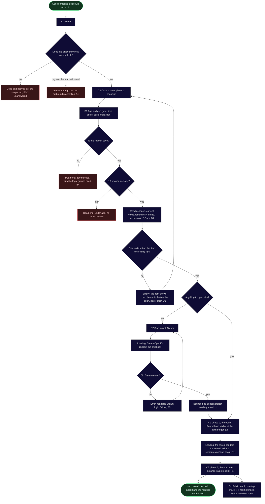
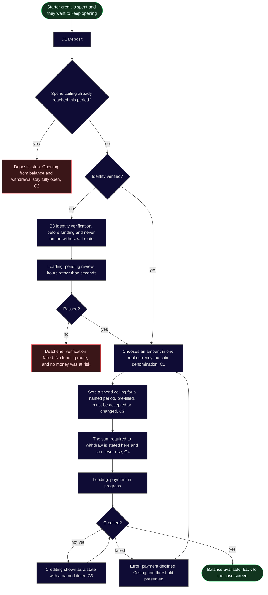
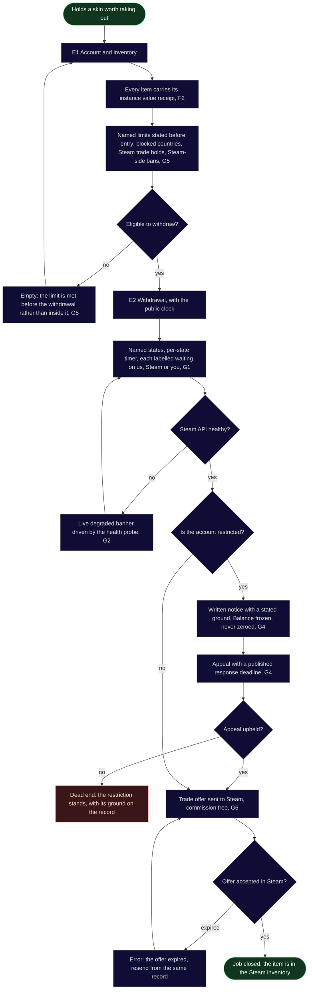
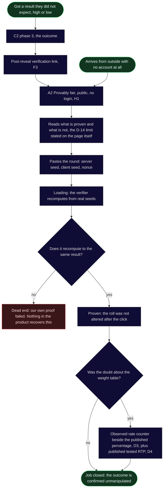

# User flows

Stage 03a, step 4, written on 11 August 2026.

**Traced onto the To-Be phases, not derived from jobs alone.** The skeleton of every route below is the eight phase path in `research/docs/cjm-to-be.md`, T1 to T8. The decision points and the dead ends are the As-Is barriers from `research/docs/cjm-as-is.md`, because a barrier is exactly a place where a real person stopped. Screen names come from the concept sitemap in `sitemap.md` and no flow introduces a screen that does not exist there.

**Colour says what the outcome is, not what the screen is.**

- **Green:** the ends of the happy path, the start and the closed job. Intermediate steps stay neutral.
- **Red:** a real dead end, a node with no path onward to the goal.
- **Grey:** everything between the ends. Intermediate screens, decision diamonds, loading, empty, and errors that recover with an arrow back.

**Three red nodes in this file are deliberate.** The rule is applied mechanically: no path to the goal means red, whatever the intent. The market exit in flow 1, the ceiling stop in flow 2 and the upheld restriction in flow 3 are all designed outcomes rather than defects, and each is explained under its diagram. Colouring them grey to make the map look healthier would be the same dishonesty the product is built against.

**Arrow colour is left out on purpose.** The pack makes node colour mandatory and arrow colour a bonus, and `linkStyle` indexes by position, so one edit silently repaints the wrong path. Node classes carry the whole signal here, which is the escape the pack itself names.

---

## Flow 1. Main job: arrive, open, get the thrill

`jtbd.md:17`. Primary persona The Opener. Covers phases T1, T2, T3, T5, T6 and T7.

**ACTIVATION NODE: `Outcome`.** `aarrr.md:114` defines activation as users who arrive and complete at least one case open, so the promised value first lands when the reveal resolves and the receipt appears. It is a concrete node in the diagram rather than an implication.

**And it is a route defect, named as the pack requires.** A first-time visitor touches four distinct screens before that node: Home, the age gate, the case screen and sign in. The threshold is three. **The product defers its first value further than the research promised**, and Related Job 2 at `jtbd.md:42` asks for the entire open-to-result experience in under 60 seconds without a confusing step, which a Steam OpenID round trip is not.

**The obvious fix is already rejected on the record, so this is carried rather than solved.** A free demo reveal on identical odds and seeds was dropped in the T2 divergence, `cjm-to-be.md:47`, on the grounds that it argues our case by demonstrating the sceptic is right about the odds and it spends the reveal, the one thing we sell, before anyone has decided anything. Reopening that here would be re-litigating a converged decision. Handed to step 6, the defect audit, with the constraint that any fix must not spend the reveal.

**Decisions in this flow.** Does this place survive a second look, T1 and T2, barrier `B1-1`. Is this market open, `B4`. Is the person 18 or over, `B3`. Are there free units on the wanted item, `B8-1`. Is there anything to open with, T4. Did Steam return, `B3-1`.

**States in this flow.** Empty: the item at zero free units, which returns to the case screen. Error: a readable Steam login failure, which returns to sign in. Loading: the Steam redirect, and the reveal itself.

**The red node the map put there on purpose.** `Market` is the outbound link to buy the item on the market instead, capability A1. It has no path to our goal, so the rule paints it red. T2 accepted that cost in writing: some share of visitors will click it and buy instead, and that is the price of the claim being believable. A map that hid this exit would be hiding the capability that makes the pre-login page credible.

**Two red nodes that are the compliance layer working correctly.** `Blocked` and `Under` are people the product must not serve. They are dead ends in the diagram and successes in the constraint.

---

## Flow 2. Funding the account and setting the ceiling

Phase T4. **This flow closes no job and says so.** Its parents are barriers `B4-3`, `B4-1` and `B7-4`, and `jtbd.md:201` records that deposit closes none of the three core jobs and is justified by documented barriers and compliance. It gets a flow because it is a locked round 1 surface with real dead ends, not because a job asked for it.

**Decisions.** Has the ceiling been reached this period, `B7-4`. Is identity verified, `B8-4`. Did the payment credit, `B4-3`.

**States.** Loading: identity review, which is the asynchronous state only the document KYC branch of `D-A` has, and payment in progress. Error: a declined payment that returns to the amount with the ceiling and threshold intact. Pending: crediting with a named timer, which is the whole of `C3`.

**The second deliberate red node.** `Stop` is the ceiling doing its job. It is red because this flow's goal is more balance and there is no path to it this period. It is not a failure state: opening from existing balance and withdrawing both stay open, which `cjm-to-be.md:66` specifies. T4 also carries a hard design constraint that belongs beside this node and is repeated here so it does not get lost: **the ceiling may never acquire completion mechanics, streaks or a session score**, because at that point it stops being a boundary and becomes a reason to keep going.

**One route this flow proves rather than draws.** There is no verification branch anywhere on the withdrawal route, `B2`. Its absence in flow 3 is the evidence, and `cjm-to-be.md` says the same thing: it is proven by code review rather than by a metric.

---

## Flow 3. Related Job 5: withdraw and get what I earned

`jtbd.md:69`. Phase T8, the floor of the entire As-Is map at -5.

**Decisions.** Eligible to withdraw, `B8-3` and `G5`. Steam API healthy, `B8-2`. Account restricted, `B8-3`. Offer accepted in Steam, which is outside our system.

**States.** Empty: a limit met before entry rather than inside the withdrawal, which is the whole point of `G5`. Error: an expired trade offer, recoverable from the same record. Loading is carried by the clock itself, which is why there is no separate loading node here: every wait in this flow is a named state with a timer rather than a spinner.

**The third deliberate red node.** `Refused` is an upheld restriction. It has no path to this flow's goal and it is red for that reason, but `G4` changes what kind of red it is: a written ground, a frozen rather than zeroed balance, and an appeal that already ran with a published deadline. The As-Is barrier `B8-3` is winning being treated as suspicious behaviour with no explanation. The dead end remains; the silence does not.

**No verification appears anywhere in this flow.** That absence is capability `B2` and it is the direct answer to `B8-4`, verification ambushes at the exit, pattern of 5.

---

## Flow 4. Related Job 3: verify the outcome after I open

`jtbd.md:51`. Primary motivation for The Researcher, secondary for The Opener. Two entries, one of them from outside the product with no account at all.

**Decisions.** Does the round recompute to the same result. **Was the doubt about the weight table**, which is the structural expression of decision `D-14`.

**States.** Loading: the recomputation. There is no empty state, because the page opens and explains before it asks anyone to paste anything.

**This flow draws a decision instead of describing it.** `cjm-to-be.md:109` calls it the most important rejection on the map: a commit-reveal scheme proves the outcome was not altered after the click, and says nothing about whether the weight table is the one we published, which is what users actually dispute. The `Doubt` diamond is that sentence as a route. The verifier closes one branch, and the other branch is closed by `D3` and `D4` on the case screen, which are different capabilities on a different surface. Anyone who later proposes that the verifier answers `B7-2` has to delete a node to do it.

**The dead end here is ours, not the user's.** `Broken` is the only node in this file where the product itself has failed rather than the person. It has no recovery by design: a verifier that disagrees with the ledger is not a UX state, it is an incident.

---

## What these flows changed in the concept sitemap

Nothing. Every screen node here already existed in `sitemap.md` and no flow needed one that was missing, which is the outcome step 2's second slice was supposed to produce and did.

**One screen appears in a flow while its scope is unsettled.** `G1 Public result` is drawn as a branch off the outcome in flow 1 and carries the scope question raised at step 2: it is a ninth public surface against a round locked at eight. It stays drawn and marked until the founder answers.
