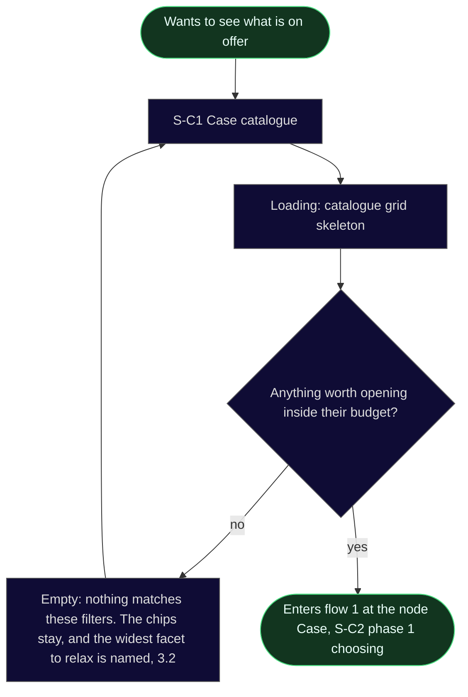
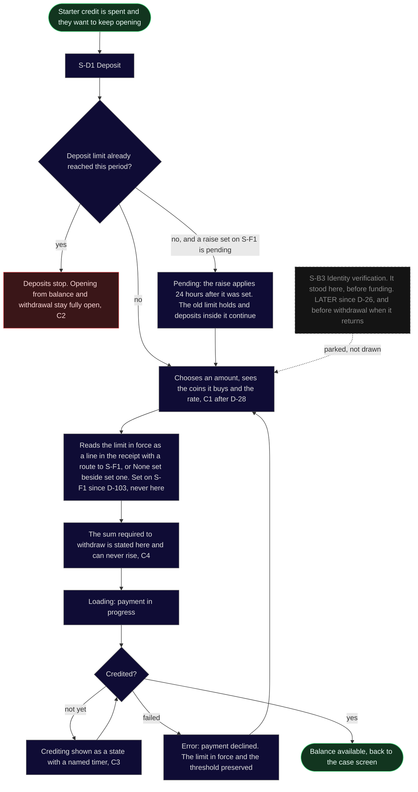
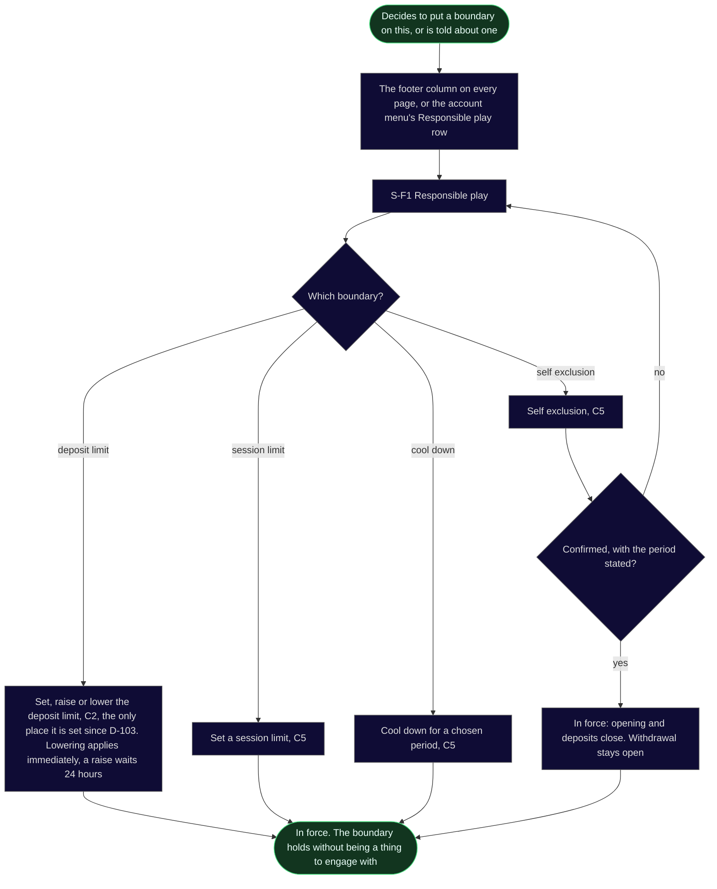
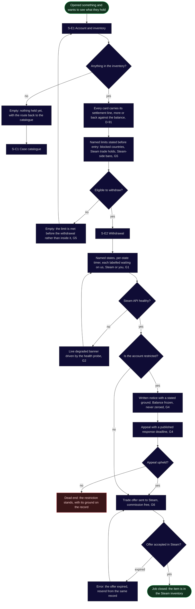
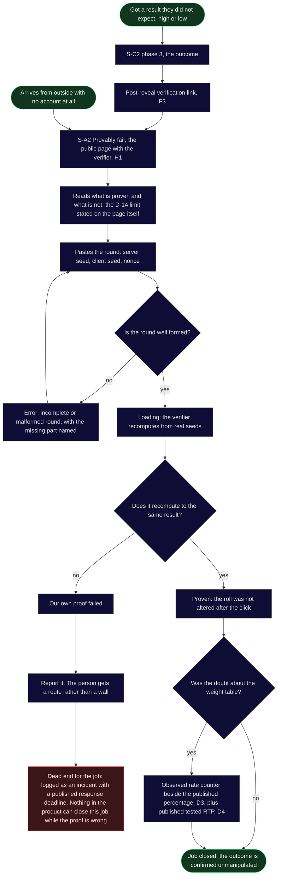
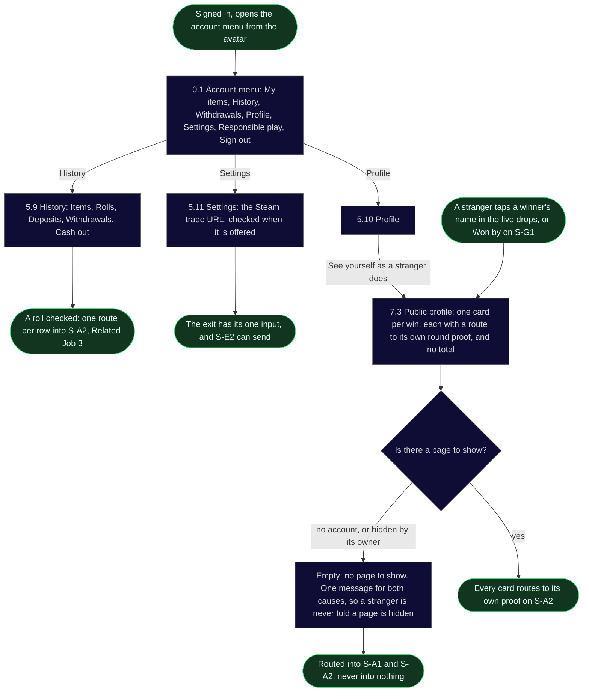
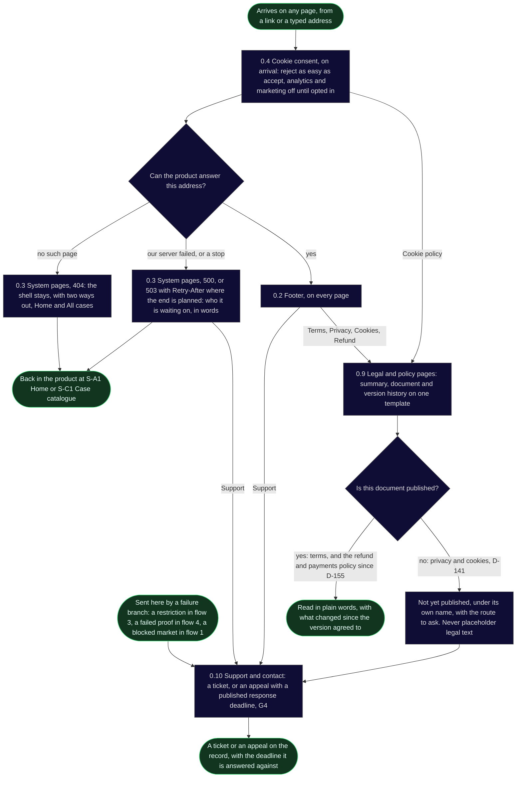

# User flows

Stage 03a, step 4, written on 11 August 2026. **Revised at step 6** after the two instrument critique: nine defects fixed, one screen code namespace renamed, one flow added.

**Traced onto the To-Be phases, not derived from jobs alone.** The skeleton of every route below is the eight phase path in `research/docs/cjm-to-be.md`, T1 to T8. The decision points and the dead ends are the As-Is barriers from `research/docs/cjm-as-is.md`, because a barrier is exactly a place where a real person stopped. Screen names come from the concept sitemap in `sitemap.md` and no flow introduces a screen that does not exist there.

**Screen codes carry an `S-` prefix and backlog capability codes do not.** Before step 6 they shared one namespace and collided on all twelve codes: `C1` meant both the catalogue and "one real currency throughout", `E1` meant both the account and "the reveal renders the settled roll". Both readings parsed, which is why it survived four steps. Backlog codes are unchanged, because they belong to `cjm-to-be.md` and this stage does not rewrite an upstream file.

**Colour says what the outcome is, not what the screen is.**

- **Green:** the ends of the happy path, the start and the closed job. Intermediate steps stay neutral.
- **Red:** a real dead end, a node with no path onward to the goal.
- **Grey:** everything between the ends. Intermediate screens, decision diamonds, loading, empty, and errors that recover with an arrow back.

~~**Four red nodes in this file are deliberate.**~~ **Six red nodes in this file are deliberate, recounted from the class lines on 3 October 2026:** `D-26` dissolved `Under`, and the old figure did not match its own list. The rule is applied mechanically: no path to the goal means red, whatever the intent. ~~The market exit and the two compliance exits in flow 1~~ **The declined evaluation, our own outbound market link and the geo block in flow 1**, the ceiling stop in flow 2, the upheld restriction in flow 3 **and the failed proof in flow 4** are designed outcomes rather than defects, and each is explained under its diagram. Colouring them grey to make the map look healthier would be the same dishonesty the product is built against.

**Arrow colour is left out on purpose.** The pack makes node colour mandatory and arrow colour a bonus, and `linkStyle` indexes by position, so one edit silently repaints the wrong path. Node classes carry the whole signal here, which is the escape the pack itself names.

---

## Amended 3 October 2026 by `D-147`. The map and the flows catch up

**Why.** Round 15 of the critique found the map and the flows still describing decisions later ones had reversed, and the node count one short.

**What changed.** Flow 1 no longer passes the dissolved 2.3: the 18+ declaration is a decision inside sign in with `D-58`'s refusal. Flow 2 reads the limit in force instead of setting one, `D-103`. Flow 2a starts from the footer or the account menu. Flow 3's receipt is the card's settlement line, `D-90` and `D-91`. A new Flow 5 reaches 5.9, 5.10, 5.11 and 7.3. Six red nodes, recounted. Every diagram parses.

---

## Amended 4 October 2026 by `D-158`. The gate where its node puts it, and the shell's own pages get a route

**Why.** Round 16 of the critique found Flow 1 firing the geo gate between the case screen and the reading of it, and gating an account's Open, against `ia/docs/pages/gate.md` section 1: reading is never gated, the gate fires on the guest Sign in press, and the account's Open passes no gate, `D-136` and `D-146` item 7. It also found three MVP pages, `0.3`, `0.9` and `0.10`, reached by no flow while Flow 5 said four pages were the whole gap.

**What changed.** Flow 1 reads first, asks whether an account exists, and only a guest meets the gate, on the way into sign in; sign in lands back on the signed-in case screen, `D-138`, and the starter credit node left the diagram until its amount exists, `D-126` and `D-130`. A new Flow 6 reaches `0.3`, `0.9`, `0.10` and the cookie consent `0.4`. Eight diagrams; still six red nodes, because Flow 6 has none.

---

## Flow 1. Main job: arrive, open, get the thrill

`jtbd.md` "Section 1". Primary persona The Opener. Covers phases T1, T2, T3, T5, T6 and T7.

```mermaid
flowchart TD
    Start(["Sees someone else's win on a clip"]) --> Home["S-A1 Home"]
    Home --> Real{"Does this place survive a second look?"}
    Real -->|no| Leave["Dead end: leaves still pre-suspected, B1-1 unanswered"]
    Real -->|"buys on the market instead"| Market["Leaves through our own outbound market link, A1"]
    Real -->|yes| Case["S-C2 Case screen, phase 1 choosing"]
    Case --> Read["Reads chance, current value, tested RTP and EV at this cost, D2 and D4. Reading is never gated"]
    Read --> Acct{"Signed in yet?"}
    Acct -->|yes| Funds{"Anything to open with?"}
    Acct -->|"no, presses Sign in"| Gate["S-B1 Geo gate, on the guest Sign in press since D-136, never on arrival and never on reading"]
    Gate --> Geo{"Is this market open?"}
    Geo -->|no| Blocked["Dead end: geo blocked, with the legal ground cited, B4"]
    Geo -->|"yes, or staged and Continue"| Signin["S-B2 Sign in with Steam, with the consent gate: terms and the 18+ declaration, two separate checkboxes, B3 since D-26"]
    Signin --> Declared{"Both boxes set?"}
    Declared -->|no| Refuse["Refused: the press stays live and names the box that is missing, D-58. Nothing is stored"]
    Refuse --> Signin
    Declared -->|yes| SteamWait["Loading: Steam OpenID redirect out and back"]
    SteamWait --> SteamOk{"Did Steam return?"}
    SteamOk -->|"refused"| SteamErr["Error: readable Steam login failure, B5"]
    SteamErr --> Signin
    SteamOk -->|"Steam is down"| SteamDown["Error: Steam unavailable, try later. Reading the product stays open"]
    SteamDown --> Case
    SteamOk -->|yes| Back["Lands on the signed-in case screen it was opened over, D-138"]
    Back --> Funds
    Funds -->|no| ToDeposit(["Open refuses with both figures and Add funds enters flow 2 at S-D1, D-155"])
    Funds -->|"yes: a balance, or the starter credit I1 once its amount exists"| Open["S-C2 phase 2, the open. Round hash visible at the spin trigger, E4. An account's Open passes no gate, D-146"]
    Open --> Reveal["Loading: the reveal renders the settled roll and computes nothing again, E1"]
    Reveal --> Landed{"Did the reveal finish on this device?"}
    Landed -->|no| Resume["Interrupted: the roll was settled before the animation, so the result waits on S-C2 phase 3 and is also in S-E1"]
    Resume --> Outcome
    Landed -->|yes| Outcome["S-C2 phase 3, the outcome. Instance value receipt, F1"]
    Outcome --> Win(["Job closed: the rush landed and the result is understood"])
    Outcome --> Share["S-G1 Public result, one-tap share, F4"]
    Share --> Alive{"Does the shared result still resolve?"}
    Alive -->|no| Gone["Empty: the result is gone or private"]
    Gone --> PFout(["Routed into S-A2, where the round can still be checked without the page"])
    Alive -->|yes| Story(["Emotional Job 2 closed: the story survives being checked"])

    classDef success fill:#12351f,stroke:#4ade80,color:#eafff9;
    classDef dead fill:#3a1618,stroke:#e5484d,color:#ffd7d7;
    classDef neutral fill:#0f0c35,stroke:#5a5a5a,color:#dddddd;
    class Start,Win,Story,PFout,ToDeposit success;
    class Leave,Market,Blocked dead;
    class Home,Real,Case,Read,Acct,Gate,Geo,Funds,Signin,Declared,Refuse,SteamWait,SteamOk,SteamErr,SteamDown,Back,Open,Reveal,Landed,Resume,Outcome,Share,Alive,Gone neutral;
```

**ACTIVATION NODE: `Outcome`.** `aarrr.md` "Primary metric (OMTM)" defines activation as users who arrive and complete at least one case open, so the promised value first lands when the reveal resolves and the receipt appears. It is a concrete node in the diagram rather than an implication.

**And it is a route defect, named as the pack requires.** A first-time visitor touches four distinct screens before that node: Home, the age gate, the case screen and sign in. The threshold is three. **The product defers its first value further than the research promised**, and Related Job 2 at `jtbd.md` "Section 2" asks for the entire open-to-result experience in under 60 seconds without a confusing step, which a Steam OpenID round trip is not.

**Amended 21 August 2026 by `D-54`, and the count is three now.** Sign in became a dialog opened over the surface a person is already on, so it is no longer a fourth screen. **Two things this does not change and the amendment prints both:** the step count is identical, because the Steam round trip and the gate are untouched; and the four listed above name the age gate, which `D-26` had already turned into the geo gate when the 18+ declaration moved into sign in. **The defect narrows, it does not close.** `docs/decisions.md` D-54.

**The obvious fix is already rejected on the record, so this is carried rather than solved.** A free demo reveal on identical odds and seeds was dropped in the T2 divergence, `cjm-to-be.md` "T2. First contact, before any account", on the grounds that it argues our case by demonstrating the sceptic is right about the odds and it spends the reveal, the one thing we sell, before anyone has decided anything. Reopening that here would be re-litigating a converged decision.

**Decisions in this flow.** Does this place survive a second look, T1 and T2, barrier `B1-1`. **Signed in yet, added in round 16 by `D-158`: it decides whether the gate and sign in stand in the route at all.** Is this market open, `B4`, **asked on the guest Sign in press since `D-136`, after the case has been read and never before an account's Open, `D-146` item 7, reordered in round 16 by `D-158`**. Is there anything to open with, T4. ~~Is the person 18 or over, `B3`.~~ **Are both boxes set, terms and the 18+ declaration, `B3`, asked inside sign in since `D-26` rather than at the gate.** **The stock decision left this flow on 21 August 2026, `D-60`:** "are there free units on the wanted item, `B8-1`" stood between reading the numbers and finding the funds, and the flow is one decision shorter because the condition cannot occur. Did Steam return, and in which of the two ways it can fail, `B3-1`. Did the reveal finish on this device. Does the shared result still resolve.

**States in this flow.** Empty: a shared result that no longer resolves, routed into the public provably fair page rather than into nothing. **The other empty left with `D-60`**, the item at zero free units returning to the case screen, and it is the only state this map has ever lost. Error: a readable Steam refusal returning to sign in, and Steam being unavailable, which returns to the case screen so a person who cannot sign in can still read the product. **Refused: a press with a box unset, which stays on sign in and names what is missing, `D-58`, and stores nothing; and an Open the balance cannot cover, which refuses with both figures and hands on to flow 2 through Add funds, `D-155`, added in round 16 by `D-158`.** Loading: the Steam redirect, and the reveal. Interrupted: the reveal that did not finish on this device.

**Two nodes moved or left in round 16, `D-158`, and the diagram above is the corrected one.** `Gate` stood between `Case` and `Read`, so the drawing gated the reading of a case and every Open, an account's included. It now stands on the guest Sign in press, where `gate.md` section 1 has always put it: reading is never gated, and the account's Open passes no gate because the gate was passed at sign in. `Credit`, "bounded no-deposit starter credit granted, I1", stood between sign in and the open; it left, because `D-126` and `D-130` took the offer off Home and off both sign in carriers until its amount exists, and since `D-138` sign in lands on the signed-in page it was opened over rather than in the open. The starter credit stays on the `Funds` edge, as a way to have something to open with once it exists.

**Why the interrupted reveal is a state and not an error, and why it was the sharpest thing this critique found.** `E1` settles the roll before the animation begins, so at the moment a connection drops the result already exists in the ledger. Without a return path the person sees an animation that never resolved beside a balance that says they won, which is `B6-1`, the animation and the credited item disagreeing, arriving through the back door of a missing state rather than through the front door of a bug.

**The red nodes, and why each is there.** `Market` is our own outbound link to buy the item on the open market instead, capability A1. It has no path to our goal, so the rule paints it red, and T2 accepted that cost in writing: some share of visitors will click it and buy instead, and that is the price of the claim being believable. `Blocked` ~~and `Under` are people~~ **is a person** the product must not serve: a dead end in the diagram and a success in the constraint. **`Under` left with `D-26`:** a declaration a person declines to make is not a refusal that can be recorded, so the consent gate's own refusal stands in its place, and it is grey because it returns to sign in. **`Leave` is the visitor who evaluated the product and declined**, which is the null result of a free evaluation rather than a broken route. It is red because the rule is mechanical, and it is the one red node a reader should not try to fix.

---

## Flow 1a. Browsing the catalogue

Added at step 6. The catalogue was an MVP screen carrying the Main Job at phase T5 with no flow passing through it at all, so it had no loading, no empty and no route.

**Deliberately minimal, and here is why.** A full browse-and-filter route would commit depth and structure that decision `D-D` may delete: ~~if the backed catalogue is small enough, Home absorbs the catalogue and this node stops existing.~~ **`D-20` closed that fork by structure on 11 August 2026: node 3.1 stays and comes off the main path, `sitemap.md` section "Depth to the main job, counted".** The minimal drawing stands on its own reason now: the main job never routes through the catalogue. What is drawn are the three states the screen needs **whether it is a page or a section of Home**, so none of this work can be thrown away by that decision.

```mermaid
flowchart TD
    K0(["Wants to see what is on offer"]) --> Cat["S-C1 Case catalogue"]
    Cat --> Load["Loading: catalogue grid skeleton"]
    Load --> Any{"Anything worth opening inside their budget?"}
    Any -->|no| Empty2["Empty: nothing matches these filters. The chips stay, and the widest facet to relax is named, 3.2"]
    Empty2 --> Cat
    Any -->|yes| Pick(["Enters flow 1 at the node Case, S-C2 phase 1 choosing"])

    classDef success fill:#12351f,stroke:#4ade80,color:#eafff9;
    classDef neutral fill:#0f0c35,stroke:#5a5a5a,color:#dddddd;
    class K0,Pick success;
    class Cat,Load,Any,Empty2 neutral;
```

**Decisions.** Is anything worth opening inside this budget, which is MVP Core Job 1 at the moment it becomes a price question. **It read "anything in stock" until 21 August 2026 and was parented on `B8-1` read forward rather than backward**, and `D-60` took both the word and the parent.

**States.** Loading, a grid skeleton rather than a generic spinner. **What it was waiting on was the live free-unit counts and that figure is withdrawn**, `D-60`, so the skeleton now waits on the tiles themselves. Empty, and since `D-60` it has one cause instead of two: a filter, a search or a category returned nothing, never the shelf running short. **The rule that used to sit here is kept in `catalogue.md` section 3** rather than deleted, because the reason it existed, that hiding sold-out items restores exactly the surprise `D1` removed, is the argument anyone reintroducing stock has to answer.

**No dead ends.** A person who finds nothing can always widen what they are looking at, and the catalogue never traps.

---

## Flow 2. Funding the account inside the limit

**Retitled after `D-103`.** It read "Funding the account and setting the ceiling" until round 15: the founder moved the setting of `C2` to `S-F1` on 27 August 2026, so the deposit reads the limit in force and never sets it.

Phase T4. **This flow closes no job and says so.** Its parents are barriers `B4-3`, `B4-1` and `B7-4`, and `jtbd.md` "Matrix Conclusion: 3 Jobs for MVP Core" records that deposit closes none of the three core jobs and is justified by documented barriers and compliance. It gets a flow because it is a locked round 1 surface with real dead ends, not because a job asked for it.

```mermaid
flowchart TD
    D0(["Starter credit is spent and they want to keep opening"]) --> Dep["S-D1 Deposit"]
    Dep --> Hit{"Deposit limit already reached this period?"}
    Hit -->|yes| Stop["Deposits stop. Opening from balance and withdrawal stay fully open, C2"]
    Hit -->|"no, and a raise set on S-F1 is pending"| Pending24["Pending: the raise applies 24 hours after it was set. The old limit holds and deposits inside it continue"]
    Hit -->|no| Amount["Chooses an amount, sees the coins it buys and the rate, C1 after D-28"]
    Pending24 --> Amount
    Ident["S-B3 Identity verification. It stood here, before funding. LATER since D-26, and before withdrawal when it returns"]
    Ident -.->|"parked, not drawn"| Amount
    Amount --> Limit["Reads the limit in force as a line in the receipt with a route to S-F1, or None set beside set one. Set on S-F1 since D-103, never here"]
    Limit --> Threshold["The sum required to withdraw is stated here and can never rise, C4"]
    Threshold --> Pay["Loading: payment in progress"]
    Pay --> Credited{"Credited?"}
    Credited -->|"not yet"| Pending["Crediting shown as a state with a named timer, C3"]
    Pending --> Credited
    Credited -->|failed| PayErr["Error: payment declined. The limit in force and the threshold preserved"]
    PayErr --> Amount
    Credited -->|yes| Bal(["Balance available, back to the case screen"])

    classDef success fill:#12351f,stroke:#4ade80,color:#eafff9;
    classDef dead fill:#3a1618,stroke:#e5484d,color:#ffd7d7;
    classDef neutral fill:#0f0c35,stroke:#5a5a5a,color:#dddddd;
    classDef parked fill:#141414,stroke:#5a5a5a,color:#8a8a8a,stroke-dasharray:4 4;
    class D0,Bal success;
    class Stop dead;
    class Ident parked;
    class Dep,Hit,Pending24,Amount,Limit,Threshold,Pay,Credited,Pending,PayErr neutral;
```

**Decisions.** Has the limit been reached this period, `B7-4`, and is a raise pending. ~~Which direction the ceiling moved.~~ Did the payment credit, `B4-3`. ~~**Three, and it was six until 22 August 2026:**~~ **Two since `D-103`, three until then and six until 22 August 2026:** the identity decision, the pass, and the appeal all left with `D-26`, **and the direction of a change left with `D-103`, because a limit is set, raised and lowered on `S-F1` and only read here.**

**States.** Loading: payment in progress. Error: a declined payment that returns to the amount with the limit in force and the threshold intact. **The identity review and the failed verification left with `D-26`**, and they were the only two asynchronous states in this flow. Pending: crediting with a named timer, `C3`, and **a ceiling raise waiting out its 24 hours**, **set on `S-F1` since `D-103` and read here as `4.3`**, which `cjm-to-be.md` "T4. Getting something to open with" specifies and which was in no flow until step 6. Without that state a later stage would write the ceiling as instantaneous in both directions, which deletes the whole point of it.

**The identity branch left this flow on 22 August 2026, and the argument that was drawn inside it is kept here rather than deleted with the nodes.** Step 6 had found the failed check drawn as an absolute dead end while capability `B2` guarantees the withdrawal route carries no verification branch at all, and the fix gave it two exits: an appeal mirroring `G4`, and the withdrawal route that was open the whole time. **`D-26` then took the whole branch out of round 1**, so the correction now applies to a parked node. It stays written because the contradiction it resolved comes back the moment the branch does.

**What the parked node does to `B2`, and it is not nothing.** `D-26` moved layer 2 from before funding to **before withdrawal**. Read as a branch inside the exit that contradicts `B2` outright. Read as a check resolved before a withdrawal is ever attempted, at the outcome, it does not, and that is the shape flow 3 already proposes below. **The second reading is the only one on which both survive**, and it is proposed rather than drawn.

**One deliberate red node remains.** `Stop` is the ceiling doing its job. It is red because this flow's goal is more balance and there is no path to it this period. It is not a failure: opening from existing balance and withdrawing both stay open, which `cjm-to-be.md` "T4. Getting something to open with" specifies. T4 carries a hard design constraint that belongs beside this node and is repeated here so it does not get lost: **the ceiling may never acquire completion mechanics, streaks or a session score**, because at that point it stops being a boundary and becomes a reason to keep going.

---

## Flow 2a. Setting a limit and stopping

Added at step 7. `S-F1 Responsible play` was the last MVP screen with no route through it, which is the same defect step 6 fixed for the catalogue and left standing here. Step 6 also promoted it out of the deep classification into the Balance control, so it now has an entry point and needs a route to match. **That entry was never rendered and `D-136` struck it: the entries are the footer column on every page and, since `D-40`, the account menu's Responsible play row, and under a boundary the + opens the limits.**

**Parents:** `B7-4`, the escalation loop, pattern of 12, plus the compliance constraint in `CLAUDE.md`, "responsible play tooling (deposit limits, session limits, self exclusion, cool down)". **No job, and there never will be one:** nobody arrives wanting to limit themselves.

**Phase, added 3 October 2026 for stage 05, `D-151`.** **T7 and T4 of `cjm-to-be.md`.** `B7-4`, the escalation loop, starts at T7, the outcome, and the limit set here is read at T4, getting something to open with, since `D-103` moved the moment it is set to this page. **Target emotion for the voice: T4's "in control of a decision already made".** Not T7's: this page is never a reaction to a result, and its tone never celebrates, never urges and never counts down.

```mermaid
flowchart TD
    R0(["Decides to put a boundary on this, or is told about one"]) --> Entry["The footer column on every page, or the account menu's Responsible play row"]
    Entry --> RP["S-F1 Responsible play"]
    RP --> Which{"Which boundary?"}
    Which -->|"deposit limit"| Ceil2["Set, raise or lower the deposit limit, C2, the only place it is set since D-103. Lowering applies immediately, a raise waits 24 hours"]
    Which -->|"session limit"| Sess["Set a session limit, C5"]
    Which -->|"cool down"| Cool["Cool down for a chosen period, C5"]
    Which -->|"self exclusion"| Self["Self exclusion, C5"]
    Self --> Confirm{"Confirmed, with the period stated?"}
    Confirm -->|no| RP
    Confirm -->|yes| Excluded["In force: opening and deposits close. Withdrawal stays open"]
    Ceil2 --> InForce(["In force. The boundary holds without being a thing to engage with"])
    Sess --> InForce
    Cool --> InForce
    Excluded --> InForce

    classDef success fill:#12351f,stroke:#4ade80,color:#eafff9;
    classDef neutral fill:#0f0c35,stroke:#5a5a5a,color:#dddddd;
    class R0,InForce success;
    class Entry,RP,Which,Ceil2,Sess,Cool,Self,Confirm,Excluded neutral;
```

**Decisions.** Which boundary, and for self exclusion only, an explicit confirmation with the period stated, because it is the one choice here that a person cannot undo on impulse.

**States.** In force, for each boundary. **No loading and no error node**, and that is deliberate rather than an omission: every action on this screen is a local state change, and a brake that can fail to apply is not a brake.

**Withdrawal stays open under self exclusion**, which is the same rule the ceiling follows at `cjm-to-be.md` "T4. Getting something to open with". A boundary stops money going in and stops play. It never traps what the person already holds, because a limit that also locks the exit would be a punishment rather than a brake, and it would give anyone a reason never to set one.

**No dead ends, and no red nodes at all.** ~~This is the only flow in the file with none.~~ ~~**Flows 1a and 5 have none either, so it is one of three.**~~ **Flows 1a, 5 and 6 have none either, so it is one of four, recounted in round 16 by `D-158`.** A person can always leave a boundary screen without setting anything, and every boundary they do set is reversible except self exclusion, which is reversible only by waiting out the period they chose themselves.

**The constraint that governs this whole screen, repeated here because it is the thing most likely to be lost.** No counters, no streaks, no status, no session score, no celebration of staying inside a limit. T4 attaches the same rule to the spend ceiling at `cjm-to-be.md` "T4. Getting something to open with": the moment a limit acquires completion mechanics it stops being a boundary and becomes a reason to keep going.

---

## Flow 3. Related Job 5: withdraw and get what I earned

`jtbd.md` "Section 2". Phase T8, the floor of the entire As-Is map at -5.

```mermaid
flowchart TD
    W0(["Opened something and wants to see what they hold"]) --> Inv["S-E1 Account and inventory"]
    Inv --> Has{"Anything in the inventory?"}
    Has -->|no| Empty3["Empty: nothing held yet, with the route back to the catalogue"]
    Empty3 --> Cat3["S-C1 Case catalogue"]
    Has -->|yes| Settle["Every card carries its settlement line, more or back against the balance, D-91"]
    Settle --> Limits["Named limits stated before entry: blocked countries, Steam trade holds, Steam-side bans, G5"]
    Limits --> Elig{"Eligible to withdraw?"}
    Elig -->|no| NotYet["Empty: the limit is met before the withdrawal rather than inside it, G5"]
    NotYet --> Inv
    Elig -->|yes| Start2["S-E2 Withdrawal"]
    Start2 --> Clock["Named states, per-state timer, each labelled waiting on us, Steam or you, G1"]
    Clock --> Health{"Steam API healthy?"}
    Health -->|no| Degraded["Live degraded banner driven by the health probe, G2"]
    Degraded --> Clock
    Health -->|yes| Review{"Is the account restricted?"}
    Review -->|yes| Notice["Written notice with a stated ground. Balance frozen, never zeroed, G4"]
    Notice --> Appeal["Appeal with a published response deadline, G4"]
    Appeal --> Resolved{"Appeal upheld?"}
    Resolved -->|no| Refused["Dead end: the restriction stands, with its ground on the record"]
    Resolved -->|yes| Send["Trade offer sent to Steam, commission free, G6"]
    Review -->|no| Send
    Send --> Accept{"Offer accepted in Steam?"}
    Accept -->|expired| Expired["Error: the offer expired, resend from the same record"]
    Expired --> Send
    Accept -->|yes| Done(["Job closed: the item is in the Steam inventory"])

    classDef success fill:#12351f,stroke:#4ade80,color:#eafff9;
    classDef dead fill:#3a1618,stroke:#e5484d,color:#ffd7d7;
    classDef neutral fill:#0f0c35,stroke:#5a5a5a,color:#dddddd;
    class W0,Done success;
    class Refused dead;
    class Inv,Has,Empty3,Cat3,Settle,Limits,Elig,NotYet,Start2,Clock,Health,Degraded,Review,Notice,Appeal,Resolved,Send,Accept,Expired neutral;
```

**The receipt on every card left this flow with `D-90`, 23 August 2026**, by founder decision, and the row it vacated on the card is the settlement since `D-91`, which is what the node in its place draws.

**Decisions.** Is there anything in the inventory at all. Eligible to withdraw, `B8-3` and `G5`. Steam API healthy, `B8-2`. Account restricted, `B8-3`. Offer accepted in Steam, which is outside our system.

**States.** Empty, twice and for different reasons: an inventory that holds nothing, which is where every new account starts and where a low-value first open leaves someone, routed back into the catalogue rather than into a blank page; and a limit met before entry rather than inside the withdrawal, which is the whole point of `G5`. Error: an expired trade offer, recoverable from the same record. Loading has no node here on purpose: every wait in this flow is a named state with a timer rather than a spinner.

**The deliberate red node.** `Refused` is an upheld restriction. It has no path to this flow's goal and it is red for that reason, but `G4` changes what kind of red it is: a written ground, a frozen rather than zeroed balance, and an appeal that already ran with a published deadline. The As-Is barrier `B8-3` is winning being treated as suspicious behaviour with no explanation. The dead end remains; the silence does not.

**No verification appears anywhere in this flow.** That absence is capability `B2` and it is the direct answer to `B8-4`, verification ambushes at the exit, pattern of 5.

**One hole this flow exposed and does not close, carried with an owner.** A person who only ever uses free entry, the starter credit or a daily free case, can reach this flow and take out a real skin **without ever having met an identity check**, because `B1` gated funding and `B2` forbids the check at the exit, and someone who never funds never met the gate. **Since `D-26` it is wider than that:** round 1 has no identity check anywhere, so the hole is not the free-entry route, it is every route. The shape that closes it without reopening `B8-4` is to raise the check **when the account first holds a withdrawable item**, at the outcome, so the person learns it with the item in hand and nothing lost rather than at the exit with everything staked. **That shape is proposed and not drawn**, because it is a compliance decision riding on `D-A`, which counsel already owns. Drawing an unconfirmed legal route into the information architecture would be the median this project's rules exist to prevent. **Still open on 3 October 2026, `D-146` item 8: where the check fires before withdrawal, and what closes while it runs, is the founder's with counsel.**

---

## Flow 4. Related Job 3: verify the outcome after I open

`jtbd.md` "Section 2". Primary motivation for The Researcher, secondary for The Opener. Two entries, one of them from outside the product with no account at all.

```mermaid
flowchart TD
    V0(["Got a result they did not expect, high or low"]) --> Out2["S-C2 phase 3, the outcome"]
    Out2 --> Link["Post-reveal verification link, F3"]
    Link --> PF["S-A2 Provably fair, the public page with the verifier, H1"]
    V1(["Arrives from outside with no account at all"]) --> PF
    PF --> Explain["Reads what is proven and what is not, the D-14 limit stated on the page itself"]
    Explain --> Verify["Pastes the round: server seed, client seed, nonce"]
    Verify --> Wellformed{"Is the round well formed?"}
    Wellformed -->|no| BadInput["Error: incomplete or malformed round, with the missing part named"]
    BadInput --> Verify
    Wellformed -->|yes| Compute["Loading: the verifier recomputes from real seeds"]
    Compute --> Match{"Does it recompute to the same result?"}
    Match -->|no| Broken["Our own proof failed"]
    Broken --> Report["Report it. The person gets a route rather than a wall"]
    Report --> Incident["Dead end for the job: logged as an incident with a published response deadline. Nothing in the product can close this job while the proof is wrong"]
    Match -->|yes| Proven["Proven: the roll was not altered after the click"]
    Proven --> Doubt{"Was the doubt about the weight table?"}
    Doubt -->|no| Closed(["Job closed: the outcome is confirmed unmanipulated"])
    Doubt -->|yes| Counter["Observed rate counter beside the published percentage, D3, plus published tested RTP, D4"]
    Counter --> Closed

    classDef success fill:#12351f,stroke:#4ade80,color:#eafff9;
    classDef dead fill:#3a1618,stroke:#e5484d,color:#ffd7d7;
    classDef neutral fill:#0f0c35,stroke:#5a5a5a,color:#dddddd;
    class V0,V1,Closed success;
    class Incident dead;
    class Out2,Link,PF,Explain,Verify,Wellformed,BadInput,Compute,Match,Broken,Report,Proven,Doubt,Counter neutral;
```

**Decisions.** Is the pasted round well formed. Does it recompute to the same result. **Was the doubt about the weight table**, which is the structural expression of decision `D-14`.

**States.** Loading: the recomputation. Error: an incomplete or malformed round, which names what is missing and returns to the input rather than rejecting silently. There is no empty state, because the page opens and explains before it asks anyone to paste anything.

**This flow draws a decision instead of describing it.** `cjm-to-be.md` "T7. The outcome" calls it the most important rejection on the map: a commit-reveal scheme proves the outcome was not altered after the click, and says nothing about whether the weight table is the one we published, which is what users actually dispute. The `Doubt` diamond is that sentence as a route. The verifier closes one branch, and the other branch is closed by `D3` and `D4` on the case screen, which are different capabilities on a different surface. Anyone who later proposes that the verifier answers `B7-2` has to delete a node to do it.

**The one dead end in this file that belongs to us and not to the person, and it now has a route through it.** `Broken` was a wall: the verifier disagreeing with the ledger left the person with no action at all. It now leads to a report and to an incident with a published response deadline. **The job still cannot be closed**, and `Incident` stays red for exactly that reason: nothing in the product can confirm an outcome while the proof of it is wrong. What changed is that the person is no longer standing in front of a wall while we call it an incident on our own side.

---

## Flow 5. The account's own pages, and a stranger's view of one

Added in round 15 of the critique, on 3 October 2026. ~~**Four MVP pages had no route through any flow:**~~ **Four of the seven MVP pages with no route through any flow, struck in round 16 by `D-158`; the other three, `0.3`, `0.9` and `0.10`, get theirs in Flow 6:** `5.9` History, `5.10` Profile, `5.11` Settings and `7.3` Public profile, the three `D-36` put on the map for the account menu and the one `D-90` built for the live feed's names. A page with no route has no states anyone has walked, which is the defect step 6 fixed for the catalogue. **This flow draws only transitions the four nodes and the wireframes already hold, and adds no screen.** The four carry no `S-` code because they arrived after the codes were set, so they are named by node number.

**Parents, printed rather than borrowed.** `5.9` stands on `F3` and Related Job 3, `jtbd.md` "Section 2". `5.10` and `7.3` have no parent in the three legal classes and print the empty cell, `D-36` and `D-90`. `5.11` has none of its own, and the field it exists for, the Steam trade URL, does, `G1` and `G5` on `B8-2` and `B8-3`, `D-81`.

```mermaid
flowchart TD
    A0(["Signed in, opens the account menu from the avatar"]) --> Menu["0.1 Account menu: My items, History, Withdrawals, Profile, Settings, Responsible play, Sign out"]
    Menu -->|"History"| Hist["5.9 History: Items, Rolls, Deposits, Withdrawals, Cash out"]
    Hist --> Checked(["A roll checked: one route per row into S-A2, Related Job 3"])
    Menu -->|"Settings"| Set["5.11 Settings: the Steam trade URL, checked when it is offered"]
    Set --> Ready(["The exit has its one input, and S-E2 can send"])
    Menu -->|"Profile"| Prof["5.10 Profile"]
    Prof -->|"See yourself as a stranger does"| Pub["7.3 Public profile: one card per win, each with a route to its own round proof, and no total"]
    T0(["A stranger taps a winner's name in the live drops, or Won by on S-G1"]) --> Pub
    Pub --> Shown{"Is there a page to show?"}
    Shown -->|"no account, or hidden by its owner"| NoPage["Empty: no page to show. One message for both causes, so a stranger is never told a page is hidden"]
    NoPage --> Routed(["Routed into S-A1 and S-A2, never into nothing"])
    Shown -->|yes| Shelf(["Every card routes to its own proof on S-A2"])

    classDef success fill:#12351f,stroke:#4ade80,color:#eafff9;
    classDef neutral fill:#0f0c35,stroke:#5a5a5a,color:#dddddd;
    class A0,T0,Checked,Ready,Shelf,Routed success;
    class Menu,Hist,Set,Prof,Pub,Shown,NoPage neutral;
```

**Decisions.** Is there a page to show, for a stranger arriving at `7.3`. **One, on purpose:** the account's own three pages are reading surfaces, and what a person does on them is already drawn in the flows that own those acts, verifying in flow 4 and withdrawing in flow 3.

**States.** Empty: no page to show, which is the same screen for an account that never existed and for one its owner hid, `D-93`, and routes into Home and the provably fair page rather than into nothing. **The owner's view of a hidden page, nothing won yet, and the states of `5.9`, `5.10` and `5.11` are internal states their nodes specify and this flow does not number**, on the rule `sitemap.md` applies to all four.

**No dead ends, and no red nodes.** Every end is either a closed job or a route back into the product.

---

## Flow 6. The shell's own pages: a wrong address, a document, a person to ask

Added in round 16 of the critique, on 4 October 2026, `D-158`. **Three MVP pages had no route through any flow:** `0.3` System pages, `0.9` Legal and policy pages and `0.10` Support and contact, and the cookie consent dialog `0.4` had none either. Flow 5 had named four pages as the whole gap. **This flow draws only transitions the four nodes already hold**, `system.md`, `legal.md`, `support.md` and `cookie.md`, **and adds no screen.** They carry no `S-` code, because cluster 0 never had one, so they are named by node number.

**Parents, printed in each node and none of them a job.** Nobody arrives wanting an error page, a policy or a consent banner. `0.3` stands on `B3-1` by way of `B5` and on `B8-2` by way of `G1` and `G2`; `0.9` stands per block on Directive 2000/31/EC Article 5(1), on `B8-3` by way of `G5`, on `B4-1` and `B4-3` by way of `C4` and `C3`, and on design principle 1; `0.10` stands per route on Article 5(1)(c), on `B8-3` by way of `G4`, and on `B3-1` by way of `B5`; `0.4` on `B1-1` and design principle 1, with the law it cites carried as a gap in the three classes, `cookie.md`.

```mermaid
flowchart TD
    S0(["Arrives on any page, from a link or a typed address"]) --> Cookie["0.4 Cookie consent, on arrival: reject as easy as accept, analytics and marketing off until opted in"]
    Cookie --> Answer{"Can the product answer this address?"}
    Answer -->|"no such page"| NotFound["0.3 System pages, 404: the shell stays, with two ways out, Home and All cases"]
    Answer -->|"our server failed, or a stop"| ServerErr["0.3 System pages, 500, or 503 with Retry-After where the end is planned: who it is waiting on, in words"]
    NotFound --> Back(["Back in the product at S-A1 Home or S-C1 Case catalogue"])
    ServerErr --> Back
    Answer -->|yes| Foot["0.2 Footer, on every page"]
    Foot -->|"Support"| Sup["0.10 Support and contact: a ticket, or an appeal with a published response deadline, G4"]
    ServerErr -->|"Support"| Sup
    F0(["Sent here by a failure branch: a restriction in flow 3, a failed proof in flow 4, a blocked market in flow 1"]) --> Sup
    Foot -->|"Terms, Privacy, Cookies, Refund"| Legal["0.9 Legal and policy pages: summary, document and version history on one template"]
    Cookie -->|"Cookie policy"| Legal
    Legal --> Published{"Is this document published?"}
    Published -->|"yes: terms, and the refund and payments policy since D-155"| ReadDoc(["Read in plain words, with what changed since the version agreed to"])
    Published -->|"no: privacy and cookies, D-141"| Unpub["Not yet published, under its own name, with the route to ask. Never placeholder legal text"]
    Unpub --> Sup
    Sup --> Answered(["A ticket or an appeal on the record, with the deadline it is answered against"])

    classDef success fill:#12351f,stroke:#4ade80,color:#eafff9;
    classDef neutral fill:#0f0c35,stroke:#5a5a5a,color:#dddddd;
    class S0,F0,Back,ReadDoc,Answered success;
    class Cookie,Answer,NotFound,ServerErr,Foot,Sup,Legal,Published,Unpub neutral;
```

**Decisions.** Can the product answer this address, which is `0.3`'s three causes: no such page, our server failed, or a stop. Is this document published, which is `D-141`'s answer for privacy and cookies and `D-155`'s page for the refund and payments policy.

**States.** Error: the 404, which keeps the shell and offers Home and All cases, `D-82`; the 500 and the 503, which say who the wait is on, and the 503 carries `Retry-After` only where the end is planned. Empty: a document not yet published, under its own name and with the route to ask, never placeholder text. The appeal and ticket states of `0.10`, and consent pending on `0.4`, are internal states their nodes specify and this flow does not number.

**Routes in that other flows already draw.** `0.10` is where three failure branches land: the restriction and its appeal in flow 3, `5.6`; the failed proof's report in flow 4, `1.4`; and a market blocked in error in flow 1, `2.2`, which `gate.md` routes to `0.10`. They are drawn here as one entry rather than redrawn.

**No dead ends, and no red nodes.** Every end is a document read, a ticket on the record or a way back into the product. **With this flow every MVP page and dialog on the map is reached by at least one flow.**

---

## What these flows changed in the concept sitemap

**Step 4 changed nothing.** Every screen node existed already, which is the result step 2's second slice was supposed to produce.

**Step 6 changed two things.** All twelve screen codes gained the `S-` prefix, and the catalogue gained flow 1a, which it needed because it was an MVP screen with no route through it and therefore no states.

**Round 15 changed nothing on the map.** Flow 5 gave four existing MVP nodes the route they lacked, `5.9`, `5.10`, `5.11` and `7.3`, and every node it draws was already on the map.

**Round 16 changed nothing on the map either, `D-158`.** Flow 6 gave `0.3`, `0.9`, `0.10` and the cookie consent `0.4` the route they lacked, and Flow 1 moved the gate to where its node puts it. Every node either flow draws was already on the map.

~~**One screen appears in a flow while its scope is unsettled.**~~ `S-G1 Public result` is drawn as a branch off the outcome in flow 1 and carried the scope question raised at step 2: it is a ninth public surface against a round locked at eight. ~~It stays drawn and marked until the founder answers.~~ **Answered on 11 August 2026 by the founder, `D-20`: option 1, the public result page exists as node `7.1`, and round 1 became nine surfaces.**
